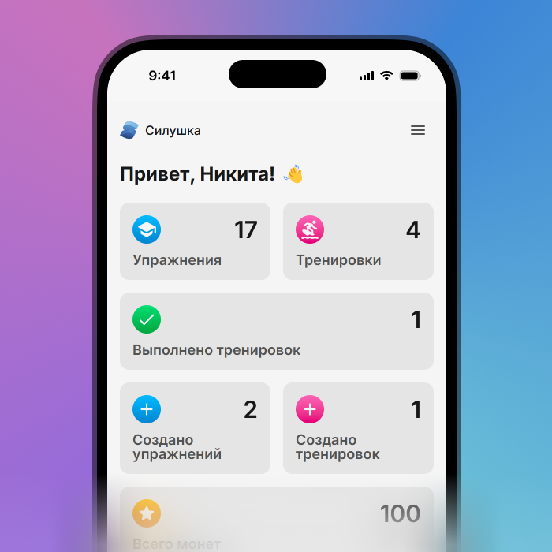

# Силушка

Приложение для занятий спортом

<div align="center">
  
</div>

## Основные фичи

В этом разделе описаны неочевидные моменты.

### 1. Каталог упражнений

Возможность добавления изображений и видео к упражнению реализована через ссылки, которые в приложении обозначаются как "ресурсы". Их также можно произвольно добавлять и удалять как подобно тегам или оборудованию.

Сложность упражнений отображается визуально с помощью звездочек: \* для простых, ** для средних и \*** для сложных упражнений.

Чтобы открыть фильтры на странице списка упражнений, необходимо нажать кнопку, расположенную слева от кнопки с иконкой "+".

### 2. Конструктор тренировок

При выборе типа упражнения приложение автоматически заполняет цель на основе данных, введенных пользователем при первом запуске (эту информацию можно изменить позже в разделе "Персонаж").

Также реализована функция автоподбора упражнений, доступная через кнопку с иконкой, расположенную справа от кнопки добавления упражнений. Пользователь может указать теги и количество упражнений для подбора, после чего цели также заполняются автоматически.

У полей всех полей есть валидация. Если пользователь вводит слишком маленькое или большое значение, то выводится соответсвующее предупреждние.

Формулы для расчёта значений автозаполнения:

- **Заметка** — `""` — пустая строка.

- **Время** — `Math.ceil(Math.max(15, (weight + height) / 10))` — рассчитывает время, основываясь на сумме веса и роста, минимальное значение составляет 15.

- **Вес** — `Math.ceil(Math.max(1, weight * 0.125))` — рассчитывает вес, умножая его на 0.125, минимальное значение составляет 1.

- **Повторения** — `Math.ceil(Math.max(10, age / 2))` — рассчитывает повторения на основе возраста, минимальное значение составляет 10.

### 3. Режим тренировки

Если пользователь пропускает упражнение, монеты за него не начисляются.

При выполнении упражнения пользователю начисляются монеты, количество которых основаны на сложности упражнения. Начисление монет сопровождается уведомлением.

В конце тренировки отображается статистика, включая количество выполненных упражнений, общее время тренировки и заработанные монеты.

В верхнем правом углу можно нажать на три полоски, чтобы открыть подробную информацию об упражнении (если текущий шаг не является отдыхом).

### 4. Персонаж

При первом запуске приложения пользователю предлагается ввести свою цель по тренировкам на неделю (эту информацию можно изменить позже в разделе "Персонаж"). На основе введенных данных на протяжении недели будет формироваться "настроение" персонажа. Например, если тренировки не выполняются, персонаж будет выглядеть грустным, а если все запланированные тренировки будут выполнены, он будет радостным и улыбающимся. Также предусмотрены промежуточные состояния. Эта механика была выбрана для визуального отображения прогресса персонажа после выполнения тренировок, поскольку если бы персонаж изменялся физически, это могло бы создать ограничения. Таким образом, у пользователя появляется мотивация заниматься упражнениями каждую неделю, чтобы достичь своей цели и порадовать своего персонажа.

В качестве элемента геймификации в приложении были внедрены приятные анимации, которые сопровождают взаимодействие пользователя с различными функциями. Эти анимации создают увлекательную атмосферу, мотивируя пользователей продолжать тренировки и зарабатывать больше наград для кастомизации своего аватара.

В магазине пользователь может приобретать различные элементы одежды и аксессуары для своего персонажа, используя заработанные монеты.

Также реализована система достижений, которые можно получить за выполнение тренировок, создание новых тренировок и добавление упражнений. Эти достижения мотивируют пользователей и сопровождаются анимацией и уведомлениями.

## Экстрафичи

- **Тёмная и светлая темы**: пользователь может переключаться между тёмной и светлой темами интерфейса в настройках, что улучшает удобство использования приложения в различных условиях освещения.

- **Цвета тегов на основе хеша их контента**: цвета тегов упражнений выбираются на основе хеша контента, что позволяет легче различать упражнения и улучшает визуальную идентификацию.

- **Поиск в разделах**: реализована функция поиска, позволяющая пользователям быстро находить нужные упражнения или тренировки в каталоге по любому текстовому содержимому.

- **Редактирование и удаление тренировок**: пользователь может свободно редактировать и удалять свои тренировки.

- **Отображение статистики**: приложение отображает статистику по разным действиям на главной странице, что помогает пользователю отслеживать свой прогресс.

- **История тренировок**: пользователь может просматривать историю своих тренировочных сессий на странице тренировки, которая группируется по дням.

- **Избранные тренировки**: реализована возможность добавления тренировок в избранное, что позволяет пользователям быстро находить и повторять любимые тренировки на главном экране (вы можете добавить или удалить тренировку из избранного на странице тренировки, открыв меню, нажав на три точки в правом верхнем углу).

- **Подсчет средней сложности тренировки**: приложение автоматически подсчитывает среднюю сложность тренировки на основе выбранных упражнений, что помогает пользователю оценить нагрузку (как и в случае с упражнениями, сложность отображается визуально с помощью звездочек: \* для простых, ** для средних и \*** для сложных тренировок).

- **Настраиваемая пауза в конструкторе тренировок**: при создании тренировки пользователь может самостоятельно указать паузу между тренировками.

## Архитектура

Этот проект использует [Feature-Sliced ​​Design](https://feature-sliced.design/docs/get-started/overview) (FSD) — это архитектурная методология для проектирования фронтенд-приложений. Проще говоря, это набор правил и соглашений по организации кода. Главная цель этой методологии — сделать проект понятнее и стабильнее в условиях постоянно меняющихся бизнес-требований.


## Хранение данных

Информация о персонаже сохраняется в local storage, так как не занимает значительного объема.

Для хранения данных об упражнениях и тренировках используется IndexedDB, что позволяет эффективно обрабатывать большие объёмы информации на клиенте. Для работы с IndexedDB применяется библиотека [dexie](https://dexie.org/), которая упрощает реактивное взаимодействие с базой данных.

## Разработка

Проект разработан с использованием [Solid JS](https://docs.solidjs.com/) и его экосистемы для создания пользовательского интерфейса и [Tailwind CSS](https://tailwindcss.com/) для стилизации. Сборка и разработка проекта осуществляется с помощью [Vite](https://vite.dev/).

Работа с формами осуществляется с использованием библиотеки [Modular Forms](https://modularforms.dev/), а валидация данных и работа со схемами выполняется с помощью [Valibot](https://valibot.dev/).

### Установка зависимостей:

Перед началом локальной работы необходимо установить все необходимые зависимости с помощью следующей команды:

```bash
npm install
```

### Запуск в режиме разработки

Для запуска проекта в режиме разработки используйте команду:

```bash
npm run dev
```

### Сборка проекта

Сборка проекта выполняется с помощью следующей команды:

```bash
npm run build
```

### Предварительный просмотр сборки

Чтобы просмотреть собранную версию приложения локально, используйте команду:

```bash
npm run start
```

### Проверка кода на наличие ошибок

Для обеспечения качества кода и выявления потенциальных ошибок используется [ESLint](https://eslint.org/).

Проверить код на ошибки можно следующей командой:

```bash
npm run lint
```

### Форматирование кода

Для автоматического форматирования кода в соответствии с установленными стандартами в проекте используется [Prettier](https://prettier.io/).

Чтобы отформатировать код необходимо использовать данный скрипт:

```bash
npm run format
```

## Тестирование

В этом проекте реализовано несколько уровней тестирования, чтобы обеспечить высокое качество кода. Ниже приведены инструкции по запуску различных типов тестов.

### Сквозные (End-to-End) тесты

Сквозные тесты написаны с использованием [Playwright](https://playwright.dev/) и находятся в директории [`./tests/`](./tests/).

Чтобы запустить сквозные тесты, выполните следующую команду в терминале:

```bash
npm run test:e2e
```

_Для корректного выполнения этих тестов может понадобиться собрать приложение и запустить его в отдельном окне терминала, а затем уже выполнить указанную команду._

### Типизация

Проект использует TypeScript для типизации.

Для запуска проверки типизации выполните команду:

```bash
npm run test:tsc
```

### Юнит тесты

Юнит тесты написаны с использованием [Vitest](https://vitest.dev/) и находятся в директории [`./src/`](./src/)).

Чтобы запустить юнит тесты, используйте следующую команду:

```bash
npm run test:unit
```
